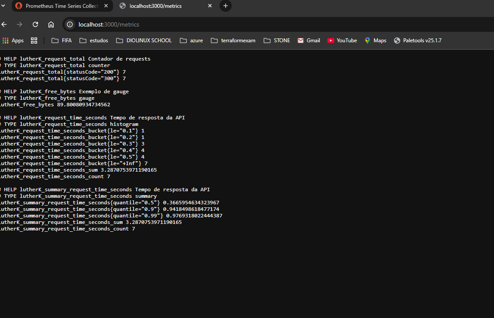
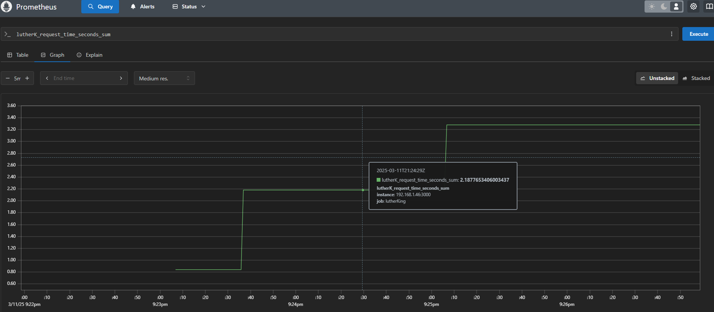
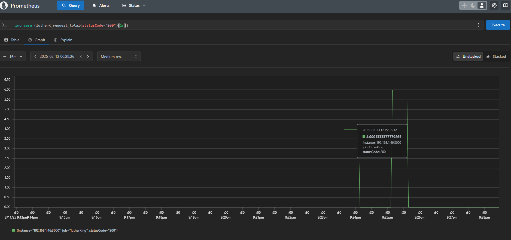
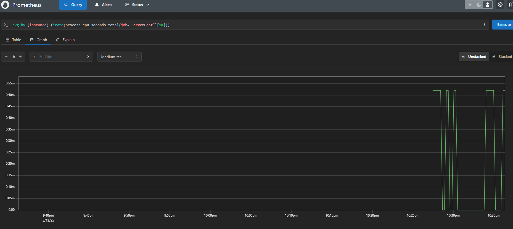

# stack-monitoring-grf-prm
Monitoting - Stack Grafana With Prometheus

# Stack Grafana + Prometheus para Monitoramento NodeJS

Este projeto configura uma stack de monitoramento utilizando Grafana e Prometheus para uma aplicação NodeJS.

## Descrição

O objetivo principal é fornecer uma solução de monitoramento robusta para aplicações NodeJS, permitindo a coleta e visualização de métricas de desempenho em tempo real.

## Componentes

* **Prometheus:** Coleta métricas da aplicação NodeJS.
* **Grafana:** Visualiza as métricas coletadas em dashboards personalizáveis.
* **kubernetes:**
* **NodeJs:**  

## Pré-requisitos

* Docker e Docker Compose instalados.
* Aplicação NodeJS em execução.
* Cluster kubernetes Local Configurado
* Ter o node js configurado com suas bibliotecas iniciais e afins.

## Como usar

# Container docker com prometheus

# Comando para inicar a app na porta, buscando um arquivo de configuração local
 - ' docker run --name prometheus --rm -d -p 9090:9090 -v C:\Users\berna\OneDrive\Documentos\Stack-Grafana\stack-monitoring-grf-prm\prometheus-docker\prometheus.yml:/etc/prometheus/prometheus.yml prom/prometheus'

# APP
###  COMMANDS##
 
 # Inicia a app
 - ' npm init '  
 # Instala uma lib
 - ' npm install --save express '
 # Após a criação do code no index.js comando para iniciar na porta correta o node
 - ' node .\index.js '
------

## App instrumentando prometheus
-   Visitar a doc oficial para verificar as instruções: https://github.com/siimon/prom-client
-   após encontrar a lib utilizar a lib
- ' npm install --save prom-client '
-   ' depois de feito isto é necessário inclui-la no code'
-   ' var prom = require('prom-client')'
-   após isso rodar a app novamente 
-    

1.  Clone este repositório.
2.  
3.  
4.  
5.  
6.  

## Contribuição

Contribuições são bem-vindas! Sinta-se à vontade para abrir issues e pull requests.

## View
 - /Métric funcional

- Grafico funcional prometheus

- Metrificando uma média de nossa implantação

 # Query teste utilizada
 "  increase (lutherK_request_total{statusCode="200"}[1m]) "

 ## Monitorando Server local
 ' avg by (instance) (irate(process_cpu_seconds_total{job="ServerHost"}[1m])) '
 

 ### Consultas PromQL